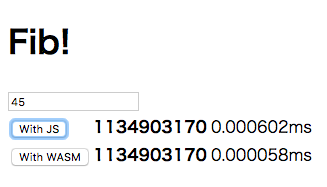
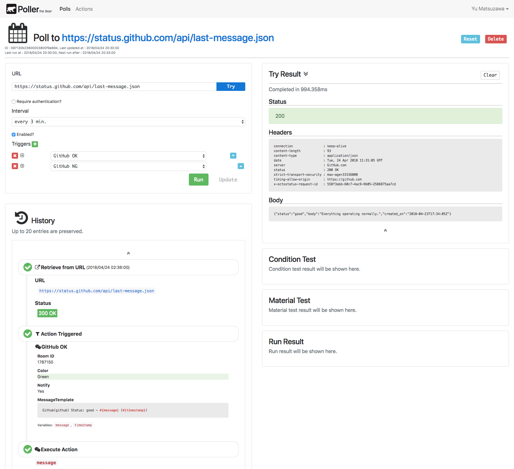

Yubot
=====

My playground [Antikythera] gear application!

Since [Antikythera] is becoming open-sourced, non-production gear repository can now be publicized too.

It contains [@access-company](https://github.com/access-company)-internal BaaS (Dodai) related codes,
though proprietary components are not tracked in VCS from the beginning, so no problem.

[Antikythera]: https://github.com/access-company/solomon

# [WASM](./wasm)

WebAssembly introductory material for internal tech-meeting in 2017/02.

See [Qiita article](https://qiita.com/ymtszw/items/5b7503b1b550f352ea8a) if you are interested! (in Japanese)

# Poller

Polling Bot builder web app.

My first serious take on [Elm](http://elm-lang.org) application development.

